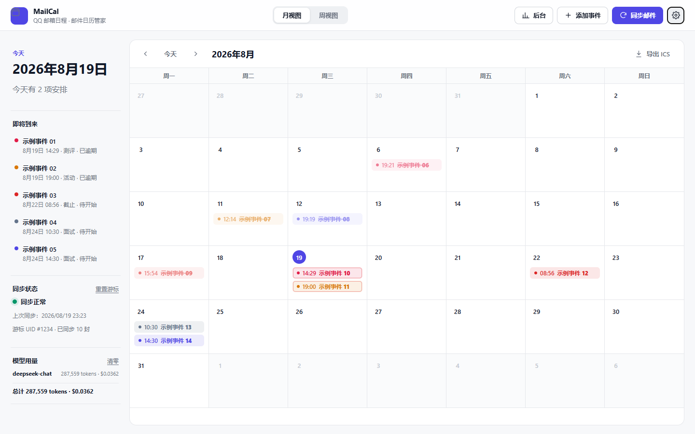
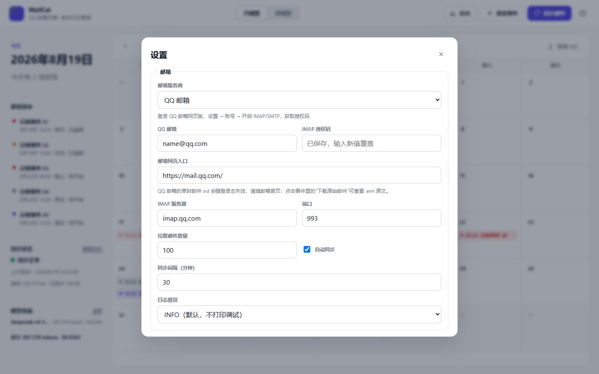
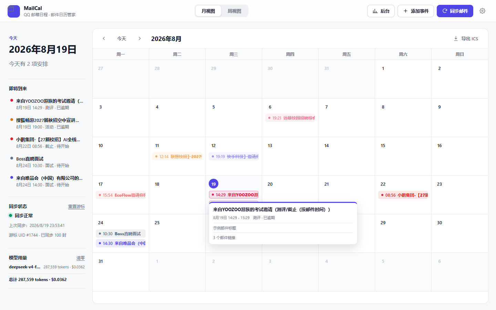
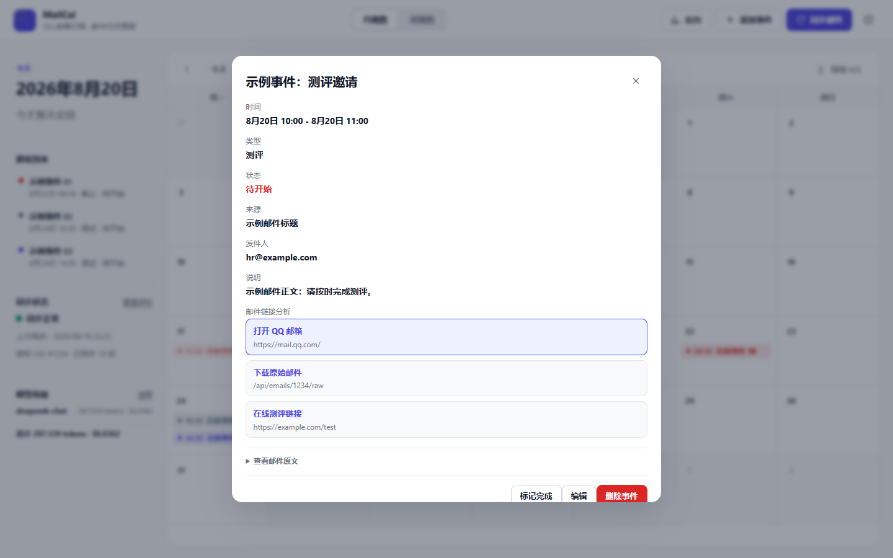
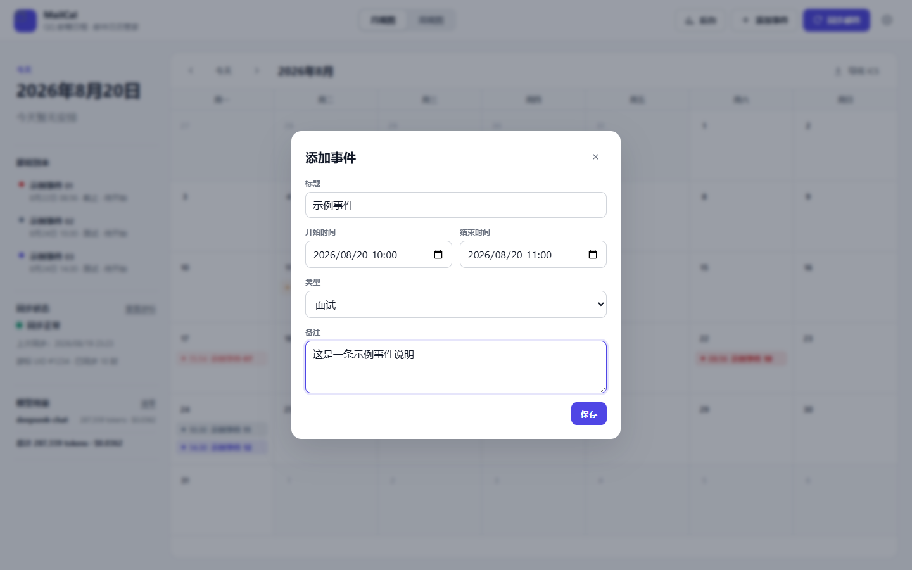
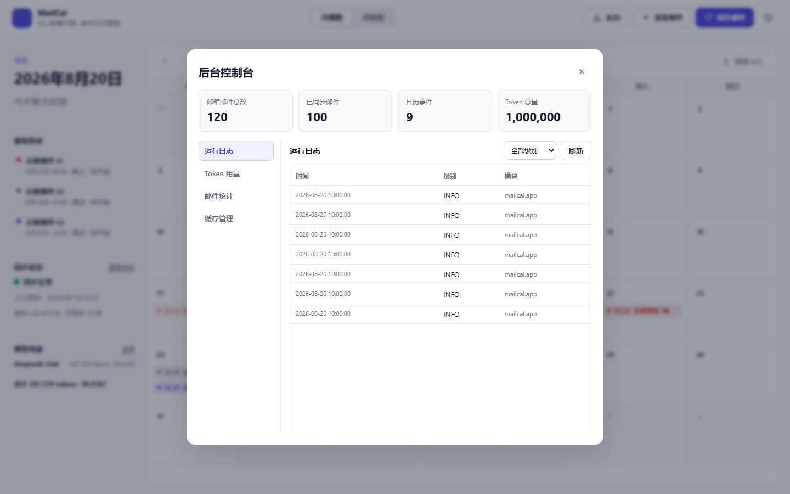

# MailCal

本地邮件日历管家：通过 IMAP 读取邮箱，把邮件中的面试、测评、会议、截止日期自动清洗成日历事件，提供 HTML 日历界面，并同时暴露 REST API 和 MCP，供 Codex 等工具调用。

## 开源与联系

MailCal 已开源，欢迎 Star 和 Issue 反馈。

- GitHub 仓库：[GlenYe-Coding/MailCal](https://github.com/GlenYe-Coding/MailCal)
- QQ 群：686046608 · [点击加入群聊 MailCal](https://qun.qq.com/universal-share/share?ac=1&authKey=nel1DVX8XS7I%2FEoMoqO%2B1BBoISK%2BbEDZ%2BacIOL8rfQlLQV7G027NsMZe28ti2iTK&busi_data=eyJncm91cENvZGUiOiI2ODYwNDY2MDgiLCJ0b2tlbiI6IkNtaWFPSUR2ZHRSdVM5eVIvRDU4MGE5N3JJb2QvTWo3ZnZ1RU84c0ZVM05QaERYOTFJOTNJb2F3YnRTVFhqeHUiLCJ1aW4iOiI5NTE0Mzg3NTUifQ%3D%3D&data=YjqF0znwclM-qI0WWbjPGIGvqxOXy3KZwrKXn3ThYPwECJ9tRQLHHXDKbgfvgM3JG0B9U0KMV-xbQO5yrUoCrA&svctype=4&tempid=h5_group_info)

## 功能

- 增量同步邮箱：使用 UID 游标记录同步位置，只处理新增邮件
- 邮件清洗：HTML 转纯文本、删除脚本样式、保留链接供分析
- 事件提取：规则引擎 + LangGraph Agent 判断邮件是否需要创建待办
- 日历界面：月视图 / 周视图、事件状态、悬浮摘要、邮件原文渲染
- 后台控制台：日志、Token 用量、邮件统计、缓存清理
- 双接口：REST API + MCP，支持本地服务或 Codex 接入
- 模型适配：OpenAI、DeepSeek、Kimi、GLM、Qwen、SiliconFlow、Ollama、自定义 OpenAI 兼容服务

## 文档

- [文档索引](docs/README.md)：MailCal 全部文档入口
- [API 文档](docs/API.md)：REST 接口、请求参数、响应格式、错误约束
- [MCP 文档](docs/MCP.md)：MCP 工具、参数约束、Codex 接入方式
- [架构文档](docs/ARCHITECTURE.md)：系统总览、同步流水线、状态机
- [配置文档](docs/CONFIGURATION.md)：`config.json`、环境变量、缓存和模型配置
- [清洗工作流](docs/WORKFLOW.md)：邮件到事件的标准化处理流程
- [JSON Schema](schemas/)：清洗邮件、事件、模型输出格式

## 项目结构

```text
MailCal/
├─ src/        后端源码
├─ static/     前端页面、样式、脚本、图片
├─ tests/      单元测试
├─ schemas/    JSON Schema
├─ docs/       全部文档与截图（含文档索引）
├─ scripts/    启动脚本
├─ data/       事件、游标、用量数据
├─ logs/       运行日志
└─ config.json 本地配置
```

## 快速启动

```bash
cd D:/Project/MailCal
python src/app.py --host 127.0.0.1 --port 5173
```

打开 <http://127.0.0.1:5173> 使用日历界面。

首次启动会自动生成 `config.json`；也可以复制 `config.example.json` 手动填写邮箱授权码和模型配置。

Windows 可直接运行 `scripts/start.bat` 或 `scripts/start.ps1`。

## 详细使用教程

### 1. 获取 QQ 邮箱授权码

打开 <https://mail.qq.com/>，进入 **设置 → 账号与安全 → 安全设置**，开启 **POP3/IMAP/SMTP/Exchange/CardDAV 服务**，然后点击 **生成授权码**。

**`auth_code` 填写的是 QQ 邮箱授权码，不是登录密码。**

### 2. 配置文件

复制示例配置：

```bash
copy config.example.json config.json
```

编辑 `config.json`：

```json
{
  "email_provider": "qq",
  "email": "name@qq.com",
  "auth_code": "your-qq-auth-code",
  "imap_host": "imap.qq.com",
  "imap_port": 993
}
```

可选模型配置：

```json
{
  "model": {
    "enabled": true,
    "provider": "deepseek",
    "api_base": "https://api.deepseek.com/v1",
    "api_key": "your-api-key",
    "model_name": "deepseek-chat"
  }
}
```

### 3. 启动项目

启动 Web 界面：

```bash
python src/app.py --host 127.0.0.1 --port 5173
```

浏览器打开 <http://127.0.0.1:5173>。



启动 MCP 服务：

```bash
python src/mcp_server.py --http --port 5174
```

### 4. 配置邮箱和模型

点击右上角 **设置**，填写 QQ 邮箱、授权码、IMAP 服务器、模型厂家、API Base 和 API Key。



### 5. 同步邮件

点击顶部 **同步邮件**，MailCal 会通过 IMAP 增量拉取邮件，并自动把可行动的邮件清洗成日历事件。

左侧会显示：

- 上次同步时间
- 同步游标 UID
- 已同步邮件数量

### 6. 查看日历事件

鼠标悬停事件可快速查看摘要。



点击事件可展开完整详情，包括时间、类型、状态、来源邮件、发件人、说明、邮件链接和邮件原文。



### 7. 手动添加事件

点击顶部 **添加事件**，填写标题、开始时间、结束时间、类型和备注后保存。



### 8. 后台控制台

点击顶部 **后台**，可以查看运行日志、Token 用量、邮件统计和缓存清理。



## REST API

| 方法 | 路径 | 说明 |
| --- | --- | --- |
| `GET` | `/api/health` | 健康检查 |
| `GET` | `/api/state` | 配置、事件、同步状态和用量 |
| `GET` | `/api/events` | 事件列表 |
| `GET` | `/api/events/{id}` | 单个事件 |
| `POST` | `/api/events` | 添加事件 |
| `PUT` / `PATCH` | `/api/events` | 修改事件 |
| `DELETE` | `/api/events` | 删除事件 |
| `POST` | `/api/sync` | 立即同步邮箱 |
| `GET` / `POST` | `/api/models` | 获取可用模型列表 |
| `POST` | `/api/config` | 保存配置 |
| `GET` | `/api/usage` | Token 用量与费用 |
| `DELETE` | `/api/usage` | 清零用量 |
| `DELETE` | `/api/sync-cursor` | 重置同步游标 |
| `GET` | `/api/admin/stats` | 后台统计 |
| `GET` | `/api/admin/logs` | 运行日志 |
| `POST` | `/api/admin/clear` | 清理缓存 / 日志 / 用量 / 事件 |
| `GET` | `/api/emails/{uid}/raw` | 下载原始邮件 `.eml` |
| `GET` | `/api/export.ics` | 导出 ICS 日历 |
| `GET` | `/api/openapi.json` | OpenAPI 摘要 |

完整参数约束见 [docs/API.md](docs/API.md)。

## MCP

```bash
python src/mcp_server.py
```

Codex 接入：

```bash
codex mcp add mailcal -- python D:/Project/MailCal/src/mcp_server.py
```

HTTP 模式：

```bash
python src/mcp_server.py --http --port 5174
```

连接地址：`http://127.0.0.1:5174/mcp`

可用工具：`list_events`、`get_event`、`sync_emails`、`list_models`、`get_status`、`reset_sync_cursor`、`get_usage`、`reset_usage`、`add_event`、`update_event`、`delete_event`。

完整参数约束见 [docs/MCP.md](docs/MCP.md)。

## 配置

配置文件为 `config.json`，支持环境变量覆盖。邮箱授权码和模型 API Key 只会以掩码形式出现在接口响应中。

详细字段见 [docs/CONFIGURATION.md](docs/CONFIGURATION.md)，环境变量清单见 `.env.example`。

## 安全说明

- 默认只监听 `127.0.0.1`，不对公网开放
- 请勿把 `config.json`、`.env`、日志中的密钥提交到代码仓库
- QQ 网页邮箱的单封邮件 `sid` 会随登录态失效；事件详情提供“打开 QQ 邮箱”和“下载原始邮件”两个可靠入口

## 测试

```bash
python -m unittest discover -s tests -v
```
