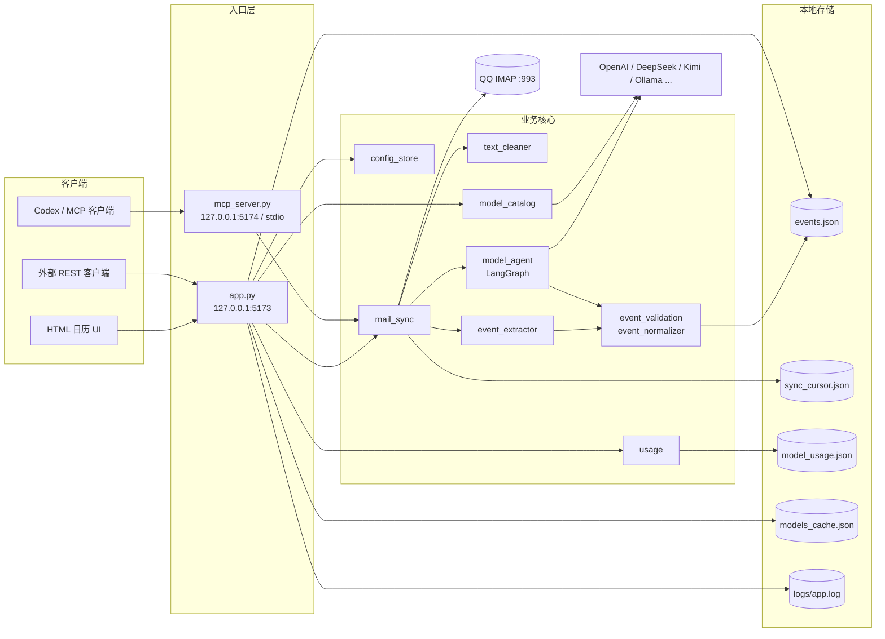
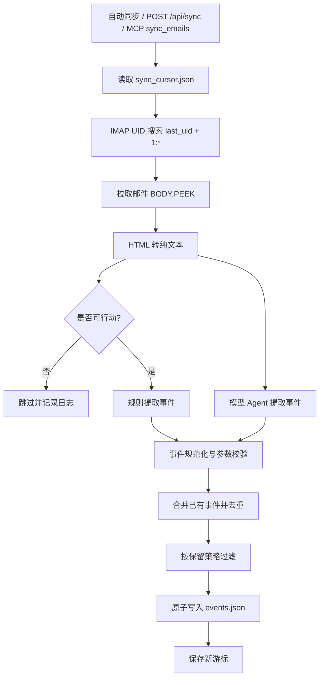
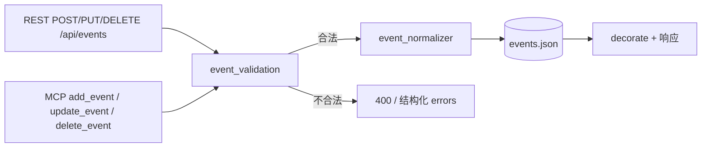
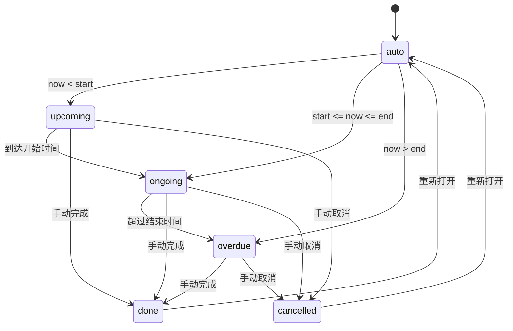

# MailCal 架构文档

## 1. 系统总览

MailCal 由 Web 服务、MCP 服务和共享业务核心组成。Web 服务提供 HTML 日历和 REST API，MCP 服务提供 Codex 等工具接入，两者复用同一套清洗、提取、校验和存储逻辑。

## 2. 模块分层

| 层 | 模块 | 职责 |
| --- | --- | --- |
| 入口 | `app.py` | HTML 页面、REST API、自动同步循环、后台管理 |
| 入口 | `mcp_server.py` | MCP stdio / streamable HTTP 工具 |
| 配置 | `config_store.py` | 配置文件、环境变量覆盖、邮箱/模型预设 |
| 同步 | `mail_sync.py` | IMAP 拉取、UID 游标、事件合并与持久化 |
| 清洗 | `text_cleaner.py` | HTML 转纯文本、去脚本样式、链接保留 |
| 提取 | `event_extractor.py` | 规则提取、可行动性判断、标题和时间推断 |
| 模型 | `model_agent.py` | LangGraph 调用模型并校验输出 |
| 模型 | `model_catalog.py` | 从模型厂家拉取真实模型列表并缓存 |
| 校验 | `event_validation.py` | API/MCP 共用的事件参数约束 |
| 校验 | `event_normalizer.py` | 时间格式、时区、结束时间规范化 |
| 状态 | `event_status.py` | 根据时间计算事件当前状态 |
| 用量 | `usage.py` | Token 消耗和费用统计 |
| 基础设施 | `file_io.py` / `logger.py` / `sync_cursor.py` | 原子写入、日志、同步游标 |

## 3. 邮件同步流水线

## 4. API / MCP 写入链路

REST API 和 MCP 的事件写入共用 `event_validation.py`，保证参数约束和错误格式一致。

## 5. 事件状态机

事件保存 `status` 时通常为 `auto`，展示层通过 `event_status.py` 根据当前时间推导 `upcoming / ongoing / overdue`；`done` 和 `cancelled` 为手动状态。

## 6. 数据文件

| 文件 | 读写方 | 说明 |
| --- | --- | --- |
| `data/events.json` | `mail_sync.py`、`app.py`、`mcp_server.py` | 日历事件 |
| `data/sync_cursor.json` | `sync_cursor.py` | 增量同步游标 |
| `data/model_usage.json` | `usage.py` | Token 用量与费用 |
| `data/models_cache.json` | `model_catalog.py` | 模型列表缓存 |
| `logs/app.log` | `logger.py` | 运行日志 |
| `config.json` | `config_store.py` | 邮箱、模型和缓存配置 |
