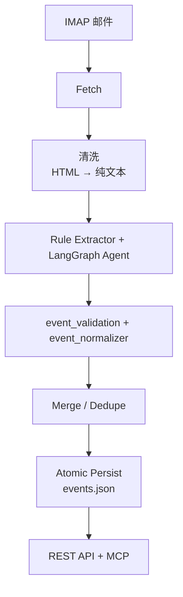

# MailCal Processing Workflow

本文档定义邮件 → 日历事件的标准化处理流程，保证输入、输出、清洗规则和模型调用格式一致，满足企业级使用要求。

## 1. 流水线总览



## 2. 输入格式

### 2.1 原始邮件

原始邮件来自 IMAP，可能包含 `text/plain`、`text/html`、内嵌图片、跟踪像素和样式。

### 2.2 清洗后邮件（模型输入）

清洗后的邮件必须满足：

```json
{
  "id": "1744",
  "date": "2026-08-19T21:01:01+08:00",
  "from": "招聘小秘书 <recruit@example.com>",
  "to": "name@qq.com",
  "subject": "测评邀请",
  "body": "测评截止时间为2026-08-25 23:00，请按时完成。"
}
```

字段约束：

| 字段 | 类型 | 约束 |
| --- | --- | --- |
| `id` | string | IMAP UID |
| `date` | string | ISO 8601 |
| `from` / `to` | string | MIME 解码后的地址 |
| `subject` | string | 去除换行和控制字符 |
| `body` | string | 纯文本，不含 HTML、CSS、script、样式和跟踪像素 |

## 3. 清洗规则

清洗由 `text_cleaner.py` 统一执行：

1. 优先读取 `text/plain`；没有时读取 `text/html`
2. 删除 `<script>`、`<style>`、`<head>`、`<title>`
3. `<br>`、`</p>`、`</div>`、`</li>`、`</tr>` 等块级结束标签转为换行
4. 删除剩余 HTML 标签
5. 解码 HTML 实体（`&amp;` → `&`）
6. 删除零宽字符和 BOM
7. 合并连续空白，压缩多余空行
8. 保留 URL 文本，供后续链接分析

## 4. 事件输出格式

所有事件在写入前必须经过 `event_normalizer.py` 校验：

```json
{
  "id": "a1b2c3d4e5f6a7b8",
  "title": "平安银行测评（截止）",
  "start": "2026-08-25T23:00:00",
  "end": "2026-08-26T00:00:00",
  "all_day": false,
  "type": "assessment",
  "color": "#e11d48",
  "status": "auto",
  "estimated": true,
  "source_subject": "【平安银行】招聘评估邀请函",
  "source_from": "hr@pingan.com.cn",
  "description": "清洗后的邮件摘要",
  "source_body": "清洗后的邮件正文",
  "source_html": "<div>原始 HTML 正文</div>",
  "links": [
    {
      "url": "https://example.com/test",
      "label": "在线测评链接",
      "context": "点击链接完成测评"
    }
  ]
}
```

字段约束：

| 字段 | 类型 | 约束 |
| --- | --- | --- |
| `start` | string | 必填，`YYYY-MM-DDTHH:MM:SS`，Asia/Shanghai 本地时间 |
| `end` | string | 必填，默认 `start + 60min`；`end <= start` 时自动修正 |
| `title` | string | 必填，非空 |
| `type` | enum | `interview / assessment / event / meeting / deadline / other` |
| `status` | enum | `auto / upcoming / ongoing / overdue / done / cancelled` |
| `estimated` | boolean | 时间是否来自规则估算 |

REST API 和 MCP 的手动增改事件也使用 `event_validation.py` 做统一参数校验：

- `title` 必填且不超过 60 字符
- `start` / `end` 必须可解析为 ISO 时间
- `end` 必须晚于 `start`
- `type` 和 `status` 必须来自事件 schema 的枚举值
- 校验失败时同时返回 `message` 和字段级 `errors`

## 5. 时间规范化规则

1. 只接受 `YYYY-MM-DDTHH:MM:SS` 或 `YYYY-MM-DD HH:MM` 等可解析格式
2. 带时区的输入统一转为 Asia/Shanghai 本地时间，再去掉时区后缀存储
3. 缺少 `end` 时自动补 `start + 60 分钟`
4. `end <= start` 时丢弃错误 end，重新按 60 分钟补齐
5. 无法解析 `start` 的事件直接丢弃，不写入日历

## 6. 模型调用契约

### 6.1 输入

只发送清洗后的纯文本邮件，禁止发送原始 HTML。

### 6.2 输出

模型只返回 JSON：

```json
{
  "events": [
    {
      "title": "项目评审",
      "start": "2026-08-20T10:00:00",
      "end": "2026-08-20T11:00:00",
      "type": "meeting"
    }
  ]
}
```

模型不得输出 Markdown 代码块；没有明确开始时间的事件不得编造。

## 7. 同步游标

- `data/sync_cursor.json` 保存上次处理的 IMAP UID
- 下次同步只处理 `last_uid + 1:*` 的新邮件
- 每封邮件独立清洗，日志记录 `processing email n/N`
- 支持“重置游标”重新处理最近邮件

## 8. 持久化

- 所有 JSON 写入使用原子替换（临时文件 + `os.replace`），避免写一半损坏
- `data/events.json`、`data/model_usage.json`、`data/sync_cursor.json` 均遵循该规则

## 9. 日志与安全

- 默认 `INFO`，调试用 `DEBUG`
- 密钥只允许出现在本地配置或环境变量，禁止写入事件、日志和聊天输出
- API 默认只监听 `127.0.0.1`，不对外网开放
- 配置支持环境变量覆盖：`.env.example` 列出全部变量
- QQ 网页邮箱不提供长期有效的单封邮件直链，`sid` 会随登录态失效；详情弹窗提供“打开 QQ 邮箱”和“下载原始邮件”两个入口
